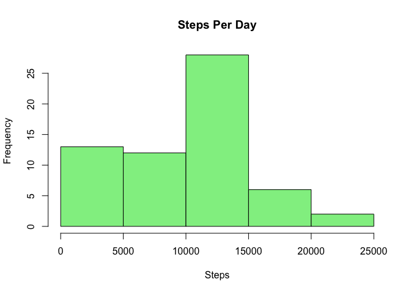
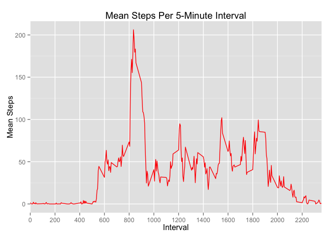
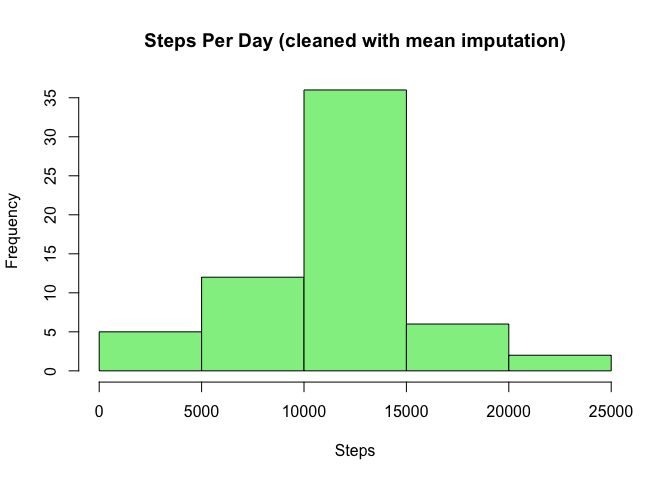

# Reproducible Research: Peer Assessment 1


## Loading and preprocessing the data

```r
options(scipen=6)
library(ggplot2)
datafile <- "activity.zip"
wd <- "/Users/jameslupolt/Documents/data_science/rep_research/RepData_PeerAssessment1"

setwd(wd)
if (!file.exists(datafile)) { 
  stop("Missing data file -- wrong working directory?")
} else {
  stepdata <- read.csv(file=unzip(datafile))
}
```


## What is the mean total number of steps taken per day?


### Here we do the following:

1) Make a histogram of the total number of steps taken each day

2) Calculate and report the mean and median total number of steps taken per day

Missing values (coded as NA) are excluded.


```r
steps_per_day <- tapply(stepdata$steps, stepdata$date, sum, na.rm=T)
mean_steps_per_day <- mean(steps_per_day)
median_steps_per_day <- median(steps_per_day)
hist(steps_per_day,main="Steps Per Day",xlab="Steps", col="lightgreen")
```

 

Mean steps per day:  **9354.2295**

Median steps per day:  **10395** 

## What is the average daily activity pattern?

### Here we do the following:

1) Make a time series plot (i.e. type = "l") of the 5-minute interval (x-axis) and the average number of steps taken, averaged across all days (y-axis)

2) Report which 5-minute interval, on average across all the days in the dataset, contains the maximum number of steps.

Again, missing (NA) values are excluded.


```r
# Build new dataframe to avoid "arguments imply differing number of rows" error from recent versions of ggplot2 
df <- data.frame(unique_intervals=unique(stepdata$interval), steps_per_interval = tapply(stepdata$steps, stepdata$interval, mean, na.rm=T))
ggplot(data=df, aes(x=unique_intervals, y=steps_per_interval)) +
    geom_line(colour="red") +
    ggtitle("Mean Steps Per 5-Minute Interval") +
    scale_x_discrete(breaks=seq(from=0, to=2400, by=200)) + 
    xlab("Interval") +
    ylab("Mean Steps")
```

 

5-minute interval with highest average steps is:  **835** 

## Imputing missing values

### Here we do the following:

1) Calculate and report the total number of missing (NA) values in the dataset

2) Replace them with the average value for that time interval on days where that interval is not missing. We'll get the mean from steps_per_interval, which has already been calculated. We'll round this since the device doesn't track partial steps.

3) Build a new dataset with the missing values filled in. 

4) Compare with the data from earlier analyses that ignored missing values.

The total number of missing values in the dataset is **2304**


```r
stepdata_cleaned <- stepdata
missing_vals <- is.na(stepdata$steps)
steps_per_interval <- tapply(stepdata$steps, stepdata$interval, mean, na.rm=T)
stepdata_cleaned$steps[which(missing_vals)] <- steps_per_interval[match(stepdata$interval[which(missing_vals)], unique(stepdata$interval))]
stepdata_cleaned$steps <- round(stepdata_cleaned$steps)
steps_per_day_cleaned <- tapply(stepdata_cleaned$steps, stepdata_cleaned$date, sum, na.rm=T)
mean_steps_per_day_cleaned <- mean(steps_per_day_cleaned)
median_steps_per_day_cleaned <- median(steps_per_day_cleaned)
hist(steps_per_day_cleaned,main="Steps Per Day (cleaned with mean imputation)",xlab="Steps", col="lightgreen")
```

 

Mean steps per day (with mean imputation):  **10765.6393**

Median steps per day (with mean imputation):  **10762** 

Using mean imputation is questionable, but this shows that it increases the step count on average somewhat. For very late and early intervals, it reduced the step count.

## Are there differences in activity patterns between weekdays and weekends?

To answer this question, we tag each date as a weekday or weekend day in the cleansed dataset and then plot.


```r
stepdata_cleaned$daycategory <- as.POSIXlt(stepdata_cleaned$date,format="%Y-%m-%d")$wday
stepdata_cleaned$daycategory[stepdata_cleaned$daycategory == 0] <- "weekend"
stepdata_cleaned$daycategory[stepdata_cleaned$daycategory == 1] <- "weekday"
stepdata_cleaned$daycategory[stepdata_cleaned$daycategory == 2] <- "weekday"
stepdata_cleaned$daycategory[stepdata_cleaned$daycategory == 3] <- "weekday"
stepdata_cleaned$daycategory[stepdata_cleaned$daycategory == 4] <- "weekday"
stepdata_cleaned$daycategory[stepdata_cleaned$daycategory == 5] <- "weekday"
stepdata_cleaned$daycategory[stepdata_cleaned$daycategory == 6] <- "weekend"
# Convert to factor so that ggplot will preserve actual values in labels
stepdata_cleaned$daycategory <- factor(stepdata_cleaned$daycategory)
# Rebuild steps_per_interval on the cleaned dataset -- also need weekday/weekend for plotting
steps_per_interval_weekend <- with(stepdata_cleaned[stepdata_cleaned$daycategory == "weekend",], tapply(steps, interval, mean))
steps_per_interval_weekday <- with(stepdata_cleaned[stepdata_cleaned$daycategory == "weekday",], tapply(steps, interval, mean))

par(mfrow = c(2,1))

plot(x <- unique(stepdata_cleaned$interval), y <- steps_per_interval_weekday, type= "l", xlab = "5-min Interval", ylab = "Steps, Weekdays", ylim=c(0,225))
lines(x = unique(stepdata_cleaned$interval), y = steps_per_interval_weekday, type = "l")
plot(x <- unique(stepdata_cleaned$interval), y <- steps_per_interval_weekend, type= "l", xlab = "5-min Interval", ylab = "Steps, Weekends", ylim=c(0,225))
lines(x = unique(stepdata_cleaned$interval), y = steps_per_interval_weekend, type = "l")
```

 

Weekdays show a bigger spike in the morning and less sustained walking activity throughout the day. Weekends show a smaller morning spike but more sustained activity throughout the day, with a later dropoff than during the week.
